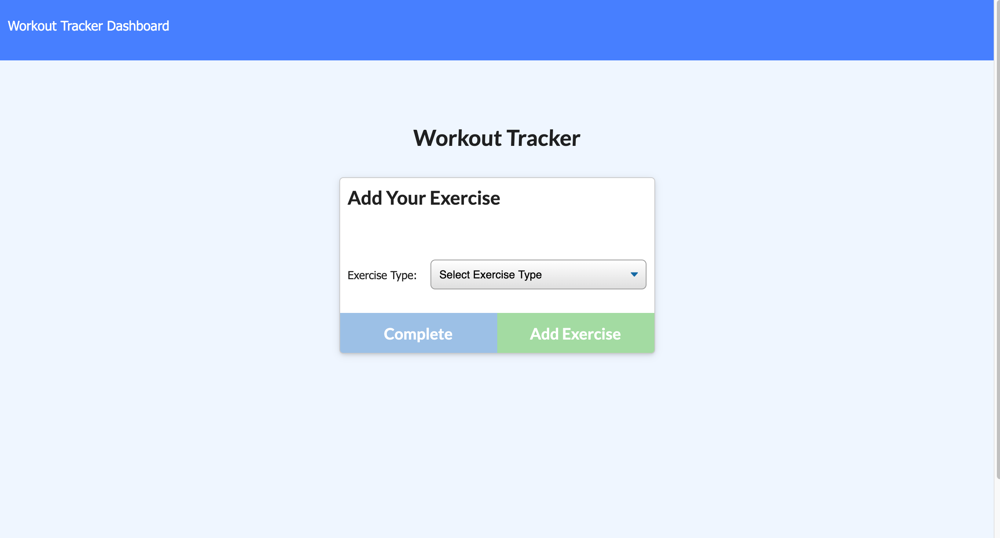

# Unit 17 Nosql Homework: Workout Tracker

For this assignment, I'll create a workout tracker.I  have already been provided with the front. This assignment, I am going to  Mongo database with a Mongoose schema and handle routes with Express.

## User Story

* As a user, I want to be able to view create and track daily workouts. I want to be able to log multiple exercises in a workout on a given day. I should also be able to track the name, type, weight, sets, reps, and duration of exercise. If the exercise is a cardio exercise, I should be able to track my distance traveled.

## Business Context

A consumer will reach their fitness goals quicker when they track their workout progress.

## Acceptance Criteria

When the user loads the page, they should be given the option to create a new workout, or continue with their last workout.

The user should be able to:

  * Add exercises to a previous workout plan.

  * Add new exercises to a new workout plan.

  * View multiple the combined weight of multiple exercises on the `stats` page.

## Technologies Used
Node.js
MongoDB
Mongoose
Express.js
Heroku
## Installation 
You will need to npm init to get all the required node modules. If you are running the code locally the local host is set to port 3000. You will also need to go in to the config folder and possibly change the config.json values. The file I used to start the project is server.js.
## Application Deployemnet Link 
 https://desolate-peak-81907.herokuapp.com/

## Preview of Application
Image of main view:

Image of adding exercises:

Image of Workout Dashboard

## Challenges
I underestimated the differences between querying in sequelize and Mongoose. I was struggling with handling promises associated with Mongoose. I ran into difficulty figuring out how to connect Robo 3T to mLab, which is very different than connecting MySQL Workbench to JawsDB. The last challenge was learning how to seed the mLab database on deployment of the app on Heroku. I figured out how to modify the scripts in the package.json to accomplish this task.

## Credits 
I created this code based on the homework prompt created by Triology Education Services. Majority of the front end code was provided in the homework prompt. Certain pieces of code I used online resources for help. I have included citations in the form of comments throughout the code. Image credits are located below the image.

## Future Development 

